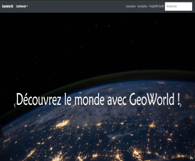

# Géo World

Contributions most welcome.

## Contents

1. [Installation](#installation)
2. [Utilisation](#utilisation)
3. [Licence](#Licence)

## Installation
* git clone https://github.com/royal1er/PPE4.git

## Utilisation

Le projet s'appuie sur une base de donnée recensant les donnée de nombreux pays. Les inscrits ont la possibilités de mettre à jour les données et de réalisé des requêtes personnalisé. Un exemple du site est disponible au lien suivant :  https://sitedemonstrationtest.000webhostapp.com/.

## Participant au projet

[Bardu Aymeric](https://github.com/aymeric131)
[Allebe Mathys](https://github.com/royal1er)

## Licence

To the extent possible under law, [Allebe Mathys](https://florianallebe6.wixsite.com/website) has waived all copyright and related or neighboring rights to this work.
